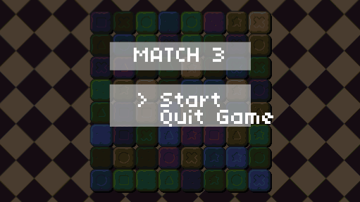

## raylib-match-3

Match-3 game written in C using Raylib library.

Based on Week 3 from course CS50’s Introduction to Game Development

* https://cs50.harvard.edu/games/2018/weeks/3/

---

### Info:

Differences to CS course:

* Used virtual screen from raylib examples/core/core_window_letterbox.c as replacement for push.lua
* Instead of full state machine - switch

### Resources

* https://opengameart.org/users/buch
* http://freemusicarchive.org/music/RoccoW/
* http://cpetry.github.io/TextureGenerator-Online/