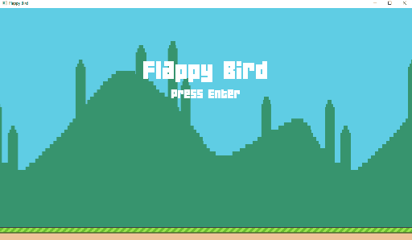

## raylib-flappy-bird

Flappy Bird game written in C using Raylib library.

Based on Week 1 from course CS50’s Introduction to Game Development

* https://cs50.harvard.edu/games/2018/weeks/1/

---

#### Resources:

* medals - https://www.kenney.nl/assets/medals
* music - https://freesound.org/people/xsgianni/sounds/388079/
